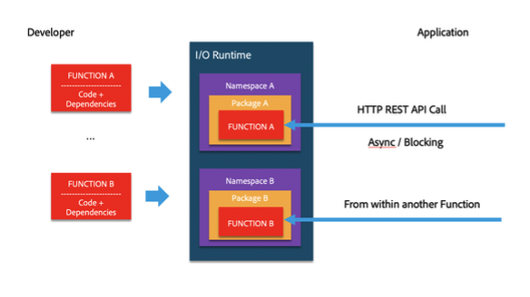

# I/O Runtime Quickstart Guide

Serverless platforms can solve a wide range of business requirements while greatly reducing the complexity associated with development and operations. However, in order to be successful, you need to consider the strengths of serverless platforms  while also being mindful (and finding ways to work around) the limitations. 

This quickstart guide explores the most critical of these considerations as they apply to I/O Runtime.

## Programming Model

Namespaces, actions, packages, shareable, compositions and web actions/APIs

Developer can write the code in JavaScript and it will be executed by a Node.js environment. This means they can also use any of the available Node modules.

Code is organized in actions (just another name for function) and gets deployed in a namespace (a namespace is owned by one tenant, and a tenant can have multiple namespaces).

An action can be invoked via an HTTP call (RESTful call or HTTP call) or from another action. Actions can be chained together in order to create complex flows using sequences (single chain of action executed one at a time and the result being passed to the next one) or compositions (trees of actions where you can take a decision at each node what action to execute next). 

Actions can be organized into packages. You can create as many packages you want inside of a namespace. You use packages to organize the code, manage different versions for the same action or to share the code with other tenants/applications. When you mark a package as shareable, anyone who has the full name, can bind that package to his own namespace (think of a symbolic link).

 
Actions can be invoked anonymously (no auth required) or with authentication. Out of the box we only support basic auth. Developers can implement their own auth. We will be adding support for IMS based auth.

## The Big Picture – Understanding I/O Runtime components

Adobe I/O Runtime is built on top of an open source project called Apache OpenWhisk. Because of this, many of the resources written for Apache OpenWhisk also apply to Adobe I/O Runtime, making the [Apache OpenWhisk repository](https://github.com/apache/incubator-openwhisk/tree/master/docs) another useful resource for you to reference.

The diagram below shows the high-level architecture of I/O Runtime built on top of OpenWhisk:

 
The whole purpose of the system is to execute the code the user has created. Let’s see what all these big components do when an action is executed:

1.	First, the nginx will receive the call that a specific action is invoked. Its role is mainly to perform SSL termination and forward the call to the Controller
2.	Controller performs tasks that disambiguates what the user is trying to do (invoke action X from namespace Y) and authenticate/authorize (verifies who is the caller and that is has the permissions to execute the code). AuthN/AuthZ is done against the Cosmos DB where information about users and namespaces are persisted.
3.	If all checks have passed, the Controller will load the action code and action settings (memory, default parameters) from the Cosmos DB/S3 and will schedule the execution with one of the available Invokers.
4.	This scheduling happens through Kafka: Controllers and Invokers communicate through Kafka messages. When an invocation request is persisted in Kafka, an ActivationId is issued to the client. This ID can be used to retrieve the result of the execution.
5.	The Invoker will take the action code and inject into a Docker container and then invoke the action. The result of the invocation is persisted in Cosmos DB under the same ActivationId.

The flow above describes what is happening inside of a cluster but we have multiple clusters, deployed in different regions. I/O Runtime is running in multiple Amazon regions today.  We plan on adding Azure clusters in the future. We route a call to one of the clusters using latency-based routing – the cluster closest to the caller gets the request. Behind the scene, customer’s code is pushed transparently to all clusters.

## Zoom In – What Is Happening When Actions Are Invoked

Let’s zoom in on what exactly happens when an action invocation request is accepted by I/O Runtime (ActivationId was issued). There are mainly two concepts that are relevant to a developer: activation lifecycle and container lifecycle - activation is our terminology for an action invocation and container is what is used to run the action.

Activation lifecycle:

* For async invocation (non-blocking) system returns 202 immediately with an ActivationId. Client will be using the ActivationId to pull the result
* For blocking invocations system returns either:
  * `200` and the result
  * `504` and an activation ID will be available for debugging (see the error message and retrieve logs if any)
* In the case of invoking too many actions per minute, the requests are throttled and the system returns 429. It is the client responsibility to scale back and retry later, because the system is not buffering the request for later processing. See more about these limits in the next sections

